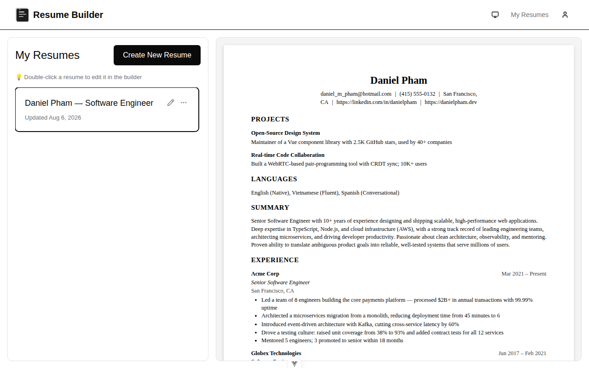
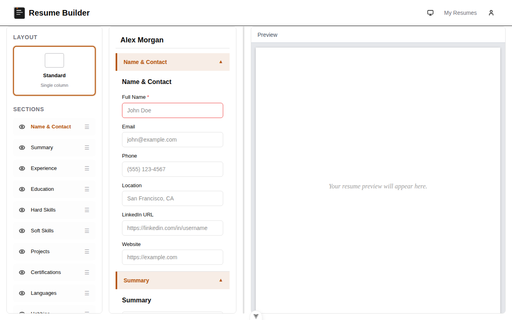
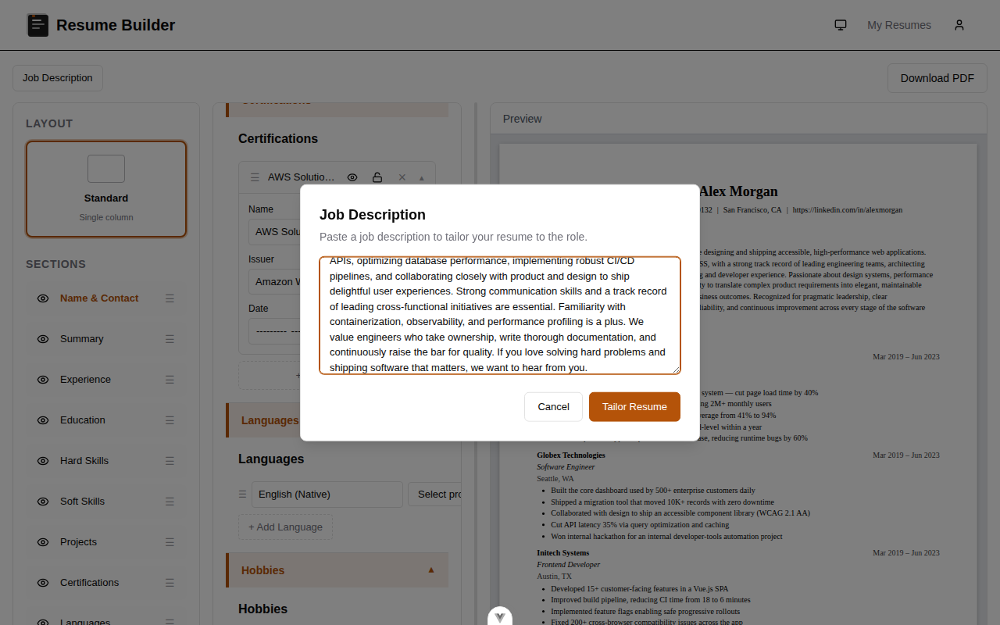
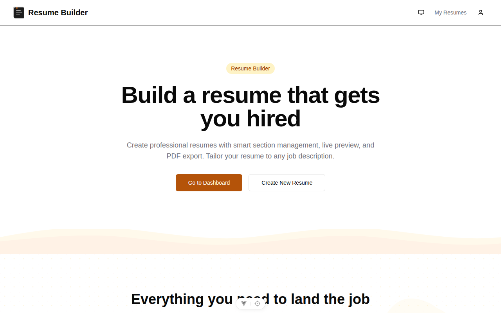
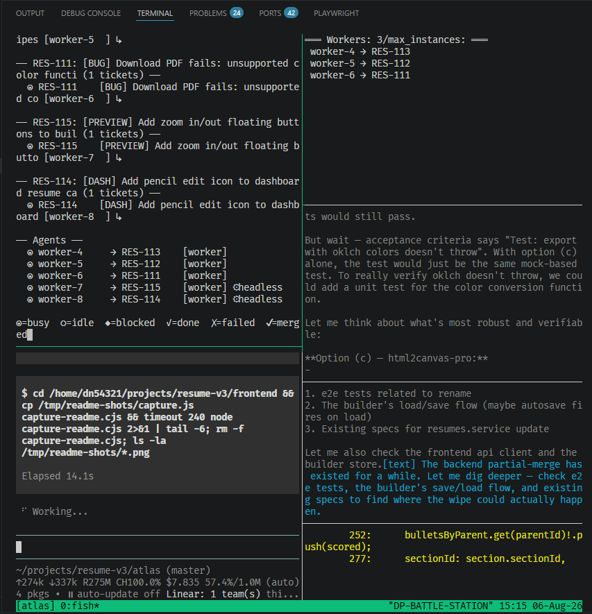

# Resume Builder

A resume-building application with a NestJS backend and Vue 3 frontend.
Build resumes in a live-preview builder, tailor them to any job description,
and export polished PDFs.

## Screenshots

| | |
|---|---|
|  |  |
| Two-pane dashboard: resume list + live preview | Section-based builder with live preview |
|  |  |
| Job Description modal — the Tailor entry point | Landing page |

## Architecture

```
resume-v3/
├── backend/          # NestJS 11 REST API
│   ├── src/          # Application source
│   ├── test/         # E2E tests
│   └── prisma/       # Database schema
├── frontend/         # Vue 3 + Vite SPA
│   ├── src/          # Application source
│   └── e2e/          # Playwright E2E tests
├── atlas/            # Ticket agent system (orchestrator, workers, boss)
├── e2e/              # Shared Playwright E2E suite (real backend + DB)
├── docs/             # Screenshots and project docs
└── .github/
    └── workflows/    # CI/CD pipelines
```

## AI Harness

This project is built **by AI, for humans** — an agentic harness writes,
tests, and ships most of the code, with a human reviewing the results.

The harness is the [`atlas`](./atlas) system: a `pi`-based orchestrator
spawns one-shot **worker agents** in isolated git worktrees, each assigned a
[Linear](https://linear.app) ticket. Workers read the ticket, implement it
end-to-end (code, tests, migrations), run the full verification suite, and
merge to master — all autonomously, in parallel. A **boss** agent oversees
the flow, fixes harness bugs, and fields human feedback, while the
orchestrator schedules spawns, sweeps stale merges, and reports status to a
live dashboard.

Why it works: every change lands with tests + a green pre-push gate
(frontend 800+ unit tests, backend 280+, e2e, coverage ≥90%), so the AI's
output is continuously validated rather than trusted on faith. The
[Agentic Development](#agentic-development) section below documents how the
harness operates, and [Running Atlas](#running-atlas-the-agent-system)
covers launching it.

## Agentic Development

This project is developed through **agentic loops and flows** — most code is
written, tested, and reviewed by AI agents, not humans.

The [ticket agent system](./AGENTS.md#ticket-agent-system) (`./atlas/atlas.sh`)
spawns parallel AI workers that implement [Linear](https://linear.app)
tickets in isolated git worktrees. Each worker runs a headless `pi` session
that reads the ticket description, dependency graph, and any PR review
context, then implements the feature end-to-end — writing code, running
tests, committing, pushing, and opening a pull request.

### Security: agents run in a contained WSL container

All agent processes — the orchestrator, workers, and the boss — run inside
the project's **WSL (Windows Subsystem for Linux) container**, isolated from
the host operating system. This containment provides several security
properties:

- **Process isolation** — agents cannot reach host processes, services, or
  files outside the WSL filesystem; their blast radius is the container.
- **Filesystem confinement** — agent file access is limited to the container
  mount; host directories are only reachable via explicit, read-only-ish
  bind mounts where required.
- **Network scoping** — agent-originated traffic flows through the container
  network namespace; hosts and LAN services are not directly addressable.
- **Clean teardown** — the container is disposable; terminating it removes
  agent state, logs, and any intermediate artifacts.

This is defense-in-depth on top of the agents' own restrictions (isolated
git worktrees, per-ticket ports, scoped API keys). Treat the container as a
**containment boundary, not a trust boundary** — secrets are still stored
scoped (see Environment Variables) and never shared across agents.

### Running Atlas (the agent system)



To launch the multi-agent ticket system:

```bash
cd atlas
./atlas.sh
```

**Prerequisites / tools you need:**

| Tool | Why | Where from |
|------|-----|------------|
| `pi` | The agent runtime (each agent is a `pi` session) | npm global: `npm i -g @earendil-works/pi-coding-agent` |
| Node.js ≥ 22 | Runtime for pi, the orchestrator, and the app | nvm / nodejs.org |
| `tsx` | Runs the orchestrator TypeScript directly | `cd atlas && pnpm install` |
| `tmux` | The dashboard/banner/boss pane layout | apt: `sudo apt install tmux` |
| Linear API key | Fetch tickets, transition states | Linear settings → API keys (`LINEAR_API_KEY`) |
| GitHub PAT | Create PRs, scan comments, webhooks | GitHub → Developer settings → classic PAT, `repo` scope (`GITHUB_PAT_KEY`) |
| ngrok token | Expose the webhook server to GitHub | ngrok dashboard (`NGROK_AUTHTOKEN`) |
| imgbb key | Host PR screenshots | api.imgbb.com (`IMGBB_API_KEY`) |

Configure secrets in `atlas/.env.agent` (see `atlas/.env.agent.template`) and
tuning in `atlas/atlas.config.yaml` (worker count, strategies, intervals).
See [`atlas/AGENTS.md`](atlas/AGENTS.md) and
[`atlas/ARCHITECTURE.md`](atlas/ARCHITECTURE.md) for the full protocol.

### How it works

1. **Graph building** — Tickets and their child dependencies are fetched from
   Linear and assembled into a DAG. Blocked tickets wait for their
   dependencies to finish.

2. **Priority queue** — Tickets are ranked: review feedback > merge conflicts
   > ready to run > blocked. Workers pick the highest-priority ticket.

3. **Isolated workers** — Each agent gets its own git worktree and port, so
   multiple features can be built in parallel without conflicts.

4. **Continuous feedback** — A webhook server receives GitHub events (PR
   comments, pushes, merge conflicts) and re-prioritizes the queue. Agents
   are preempted or spawned in response.

5. **Completion** — On success, the agent commits, pushes, creates a PR, and
   transitions the Linear ticket to Done. On failure, it retries with the
   previous attempt's output as context.

The result is a self-correcting development loop: tickets flow from Linear
through AI agents, into pull requests, through human review, and back to
the agents for iteration — all orchestrated automatically.

## Quickstart

```bash
# 1. Set up environment files (generates encryption keys, syncs templates)
./setup.sh

# 2. Start the backend (http://localhost:3000)
cd backend && pnpm install && pnpm start:dev

# 3. Start the frontend (http://localhost:5173)
cd frontend && pnpm install && pnpm dev
```

`setup.sh` scans the project root, `backend/`, and `frontend/` for `.template`
files and creates corresponding env files. It preserves existing values,
fills in missing keys, and auto-generates secrets for placeholders like
`<ENC:AES-256>` (AES-256-GCM keys) and `<RANDOM:32>` (random strings). Run
it whenever new `.template` files are added or existing templates gain new
keys.

## Testing

```bash
# Backend
cd backend
pnpm test          # Unit tests
pnpm test:e2e      # E2E tests (Jest + supertest)
pnpm test:cov      # Coverage (90% threshold)

# Frontend
cd frontend
pnpm test:unit     # Unit tests (Vitest)
pnpm test:e2e      # E2E tests (Playwright)
```

## CI/CD

Pull requests trigger the [E2E Tests](.github/workflows/e2e.yml) workflow, which runs backend and frontend E2E suites in parallel on every push.

## Tech Stack

| Layer     | Backend                | Frontend              |
| --------- | ---------------------- | --------------------- |
| Framework | NestJS 11              | Vue 3.5               |
| Language  | TypeScript 5.7         | TypeScript 6.0        |
| Runtime   | Node.js 24+            | Node.js 22+           |
| Database  | SQLite (Prisma 7)      | —                     |
| Tests     | Jest 30 + supertest    | Vitest 4 + Playwright |
| Linting   | ESLint 9 + Prettier    | ESLint 10 + oxlint    |
| Formatting| Prettier               | oxfmt                 |

## Environment Variables

See `.env.template` in each package directory for required variables.

## License

UNLICENSED — Private project.
